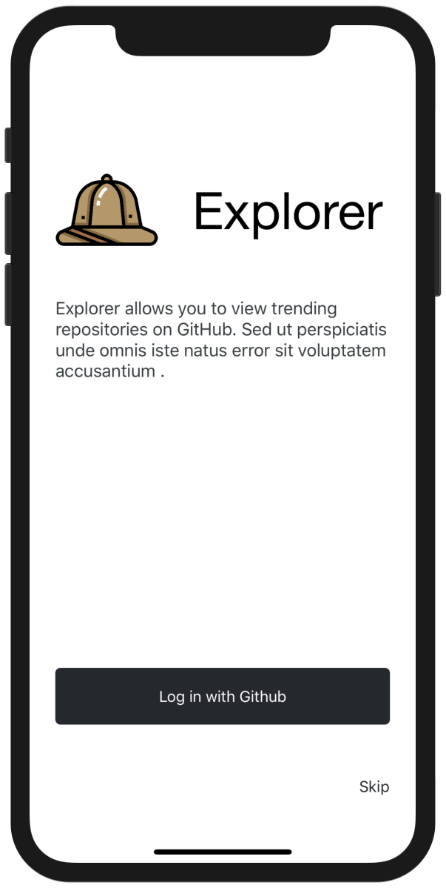
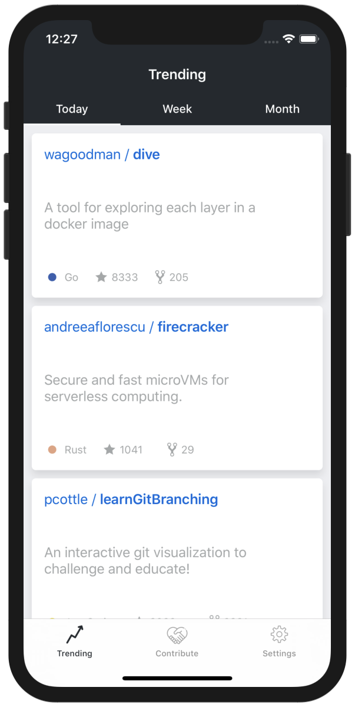
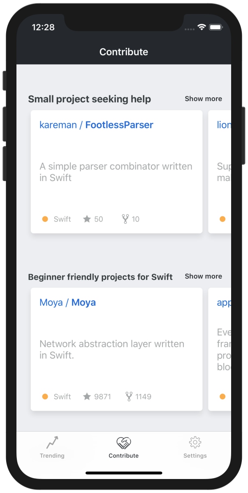
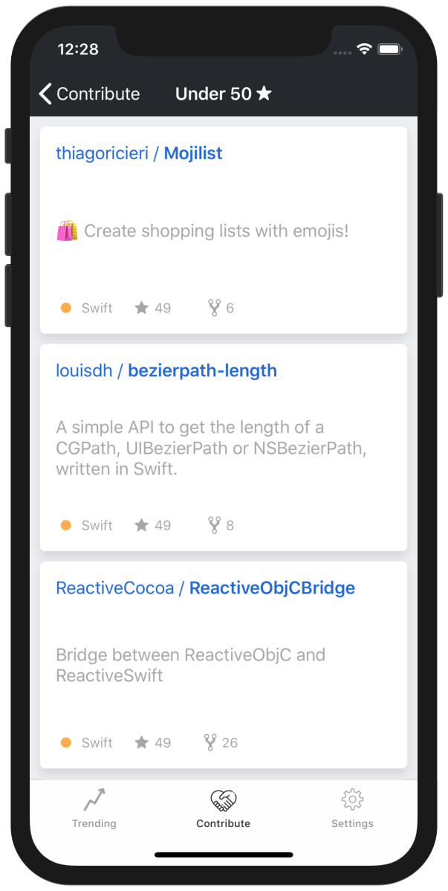
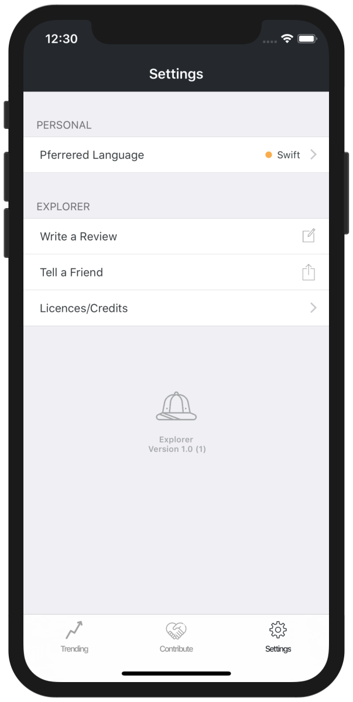
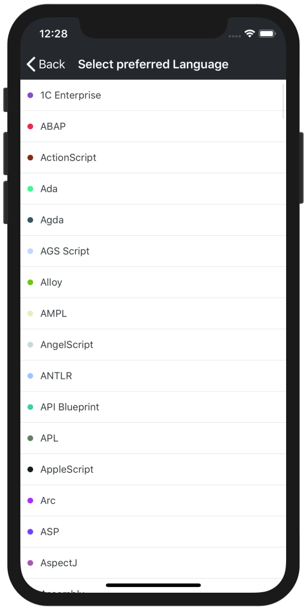

    

    
    

## Screenshots
 

    </a>
    </a>
    </a>

    </a>
    </a>
    </a>

 

## Features
- [x] Clean architecture ([MVVM](https://en.wikipedia.org/wiki/Model%E2%80%93view%E2%80%93viewmodel))
- [x] Flow coordinators
- [x] Firebase Cloud Functions
- [x] Firebase Remote Config
- [x] GitHub GraphQL API v4
- [ ] Repository detail screen 
- [ ] Color themes in Light and Dark modes
- [ ] Add tests

## Work in Progress
Please be advised that the project is a work in progress and is incomplete.

## Requirements
`Explorer` is written in Swift 4.2. Compatible with iOS 11.0+  
If you want to run the app yourself, you need to add an GitHub API Key as environment variable (GITHUB-KEY).

## Contributing
At this stage please contact me before contributing code.

## Author
Zagahr - [@zagahr](https://twitter.com/zagahr)

## License / Credits
`Explorer` is available under the MIT license. Some of the dependencies are licensed differently, with the BSD license, for example. 
Icons made by [Freepik](https://www.freepik.com/) from www.flaticon.com
